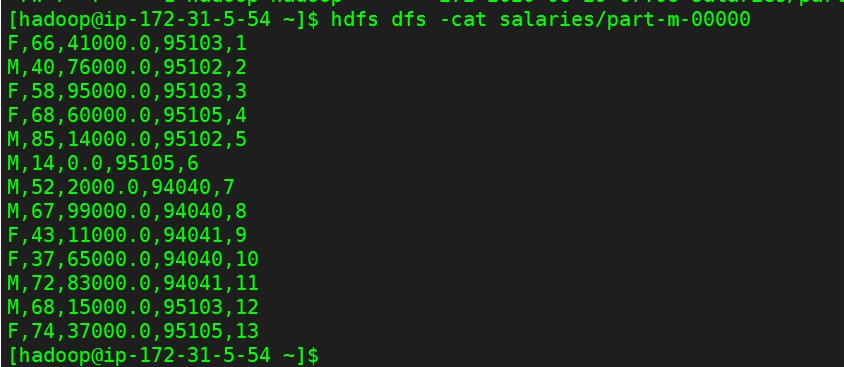
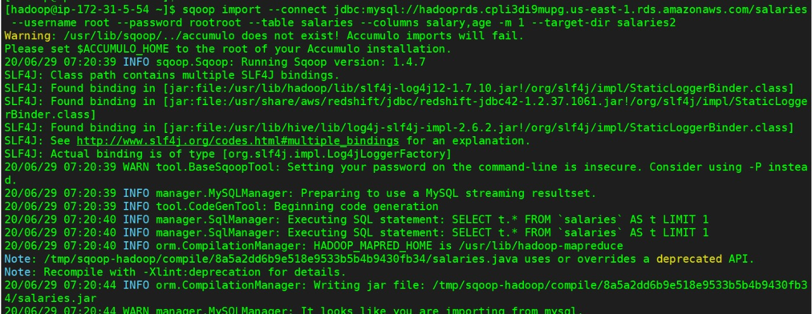
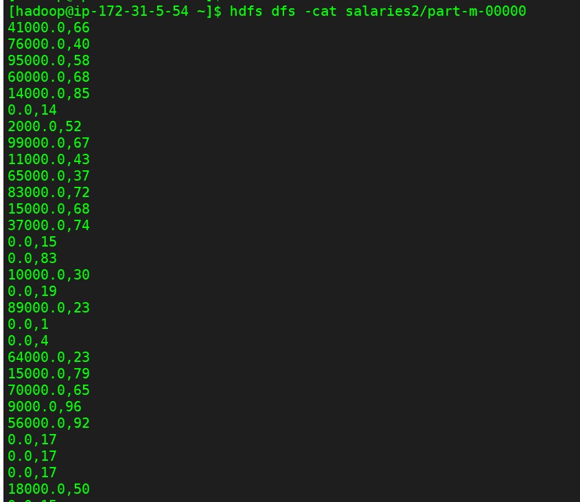

# LAB 3.1 -> Importing RDBMS Data into HDFS

***Objective -> Import data from a database into HDFS.***

***Pre-requisites -> Hadoop cluster on EMR should be up and running***

Following are the steps to be performed in this lab:-

1. Create an Amazon RDS database. Follow the [link](https://github.com/prem1204/Pranay-CDAC/blob/aws-cloud/aws-services/rds-create-database.md) to create a new database.

2. Connect this database with MySQL Workbench. Check out this [link](https://github.com/prem1204/Pranay-CDAC/blob/aws-cloud/aws-services/rds-connect-db.md) to connect your RDS database to MySQL Workbench
   
3. Now create a new salaries table using following sql command

*create table salaries (
gender varchar(1),
age int,
salary double,
zipcode int);*

4. Load the data given in salaries.txt file into this salaries table using following sql command

*load data infile '<path-to-file>/salaries.txt' into table salaries fields terminated by ',' ;*

*[Note] -> If you get an infile error while inserting the data follow below steps:-*

      *  Close current SQL connection
      *  Right click on your Connection and select 'Edit Connection'
      *  Click on Advanced
      *  Add following line to 'Others'

        *OPT_LOCAL_INFILE=1*

      *  Now Reconnect to your database

5. Now, ssh to your EMR cluster and make sure Sqoop is pre installed in this cluster. 

Click [here](https://github.com/prem1204/Pranay-CDAC/blob/Big-Data/aws-services/emr-cluster-creation.md) to create new EMR cluster

6. Run sqoop import command to import data from sql database to hdfs

7. Now check whether salaries directory is created on hdfs with 5 files present as shown below

8. To verify whether data is present in these file use cat command

9. Now we will import only salary and age data from the database and put it into new directory named salaries2

10. Now check whether salaries2 directory is created on hdfs with 2 files present as shown below

11. To verify whether data is present in this file use cat command

12. Now we will use --split-by command to split our data accoring to a certain column value and put it into new directory named salaries3

13. Now check whether salaries3 directory is created on hdfs with 3 files present as shown below

14.  To verify whether data is present in this file use cat command

*** Result -> You have imported the data from MySQL to HDFS using the entire table, specific columns, and also using the result of a query.***
