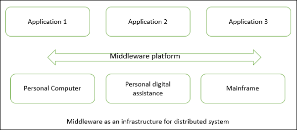
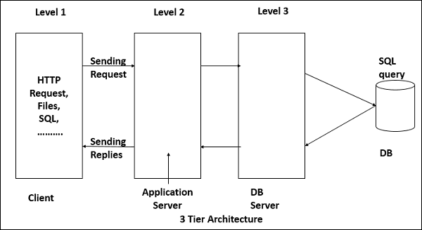
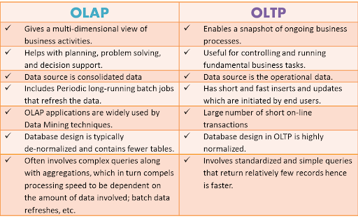

# DAY 2 -> COMPUTING

## Distributed Computing 

Distributed computing is a field of computer science that studies distributed systems. A distributed system is a system whose components are located on different networked computers, which communicate and coordinate their actions by passing messages to one another. The components interact with one another in order to achieve a common goal. Three significant characteristics of distributed systems are: concurrency of components, lack of a global clock, and independent failure of components. Examples of distributed systems vary from SOA-based systems to massively multiplayer online games to peer-to-peer applications.

A computer program that runs within a distributed system is called a distributed program (and distributed programming is the process of writing such programs). There are many different types of implementations for the message passing mechanism, including pure HTTP, RPC-like connectors and message queues.

Distributed computing also refers to the use of distributed systems to solve computational problems. In distributed computing, a problem is divided into many tasks, each of which is solved by one or more computers, which communicate with each other via message passing.

## Distributed Computing Architecture

### Middleware as an infrastructure for distributed system

Middleware is an infrastructure that appropriately supports the development and execution of distributed applications. It provides a buffer between the applications and the network.

It sits in the middle of system and manages or supports the different components of a distributed system. Examples are transaction processing monitors, data convertors and communication controllers etc.

   

### Client-Server Architecture

The client-server architecture is the most common distributed system architecture which decomposes the system into two major subsystems or logical processes −

Client − This is the first process that issues a request to the second process i.e. the server.

Server − This is the second process that receives the request, carries it out, and sends a reply to the client.

In this architecture, the application is modelled as a set of services that are provided by servers and a set of clients that use these services. The servers need not know about clients, but the clients must know the identity of servers, and the mapping of processors to processes is not necessarily 1 : 1

   

### Multi-Tier Architecture (n-tier Architecture)

Multi-tier architecture is a client–server architecture in which the functions such as presentation, application processing, and data management are physically separated. By separating an application into tiers, developers obtain the option of changing or adding a specific layer, instead of reworking the entire application. It provides a model by which developers can create flexible and reusable applications.

  [n_tier](../../Pranay-CDAC/notes/images/n_tier_architecture.jpg)

The most general use of multi-tier architecture is the three-tier architecture. A three-tier architecture is typically composed of a presentation tier, an application tier, and a data storage tier and may execute on a separate processor.

***Presentation Tier***
Presentation layer is the topmost level of the application by which users can access directly such as webpage or Operating System GUI (Graphical User interface). The primary function of this layer is to translate the tasks and results to something that user can understand. It communicates with other tiers so that it places the results to the browser/client tier and all other tiers in the network.

***Application Tier (Business Logic, Logic Tier, or Middle Tier)***
Application tier coordinates the application, processes the commands, makes logical decisions, evaluation, and performs calculations. It controls an application’s functionality by performing detailed processing. It also moves and processes data between the two surrounding layers.

***Data Tier***
In this layer, information is stored and retrieved from the database or file system. The information is then passed back for processing and then back to the user. It includes the data persistence mechanisms (database servers, file shares, etc.) and provides API (Application Programming Interface) to the application tier which provides methods of managing the stored data.

    

## Horizonatal and Vertical Scaling 

Horizontal scaling means that you scale by adding more machines into your pool of resources whereas Vertical scaling means that you scale by adding more power (CPU, RAM) to an existing machine.

Horizontal-scaling is often based on the partitioning of the data i.e. each node contains only part of the data, in vertical-scaling the data resides on a single node and scaling is done through multi-core i.e. spreading the load between the CPU and RAM resources of that machine.

With horizontal-scaling it is often easier to scale dynamically by adding more machines into the existing pool — Vertical-scaling is often limited to the capacity of a single machine, scaling beyond that capacity often involves downtime and comes with an upper limit.

Good examples of horizontal scaling are Cassandra, MongoDB, Google Cloud Spanner. A good example of vertical scaling is MySQL — Amazon RDS (The cloud version of MySQL). It provides an easy way to scale vertically by switching from small to bigger machines. This process often involves downtime.

## Advanatges of distributed computing 

1. Resource sharing − Sharing of hardware and software resources.
2. Openness − Flexibility of using hardware and software of different vendors.
3. Concurrency − Concurrent processing to enhance performance.
4. Scalability − Increased throughput by adding new resources.
5. Fault tolerance − The ability to continue in operation after a fault has occurred.

## OLTP VS OLAP

   
